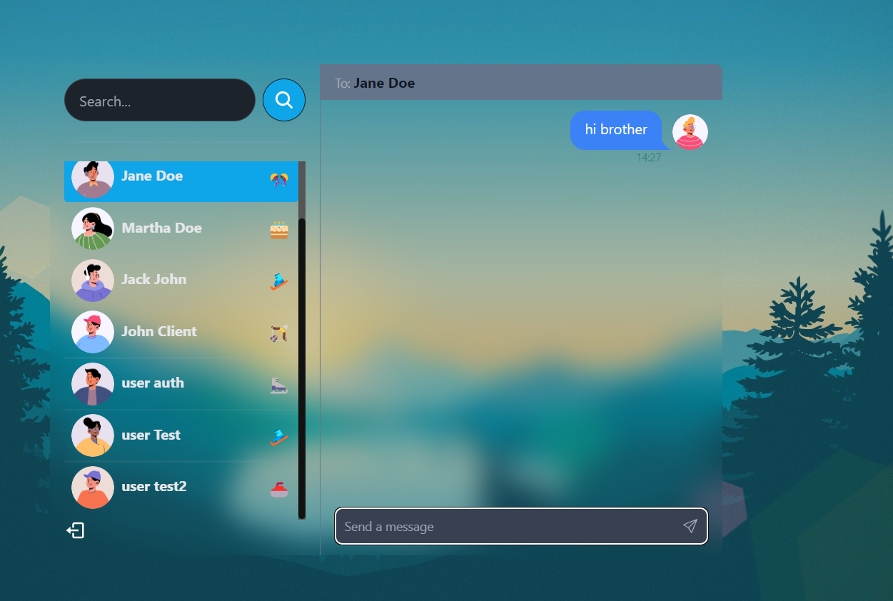

# Real Time chat App

Aplicacion realizada con fines practico en mis tiempos libres, cree la interfaz de usuario siguiendo la tendencia de Glassmorphism dando una apariencia agradable a la vista del usuario.
Cree un backend con nodejs, express y MongoDB para la generacion de rutas y poder almacenar los chats, use esta base de datos ya que creo que es optima una base de datos de este estilo que requieren actualizacion inmediata de informacion

